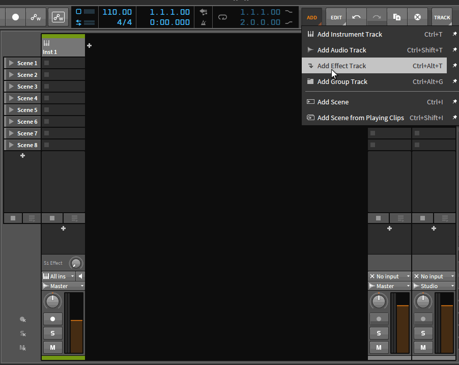

# Looper4BitwigScript
A simple looper script for bitwig

Put the folder Looper in Bitwig Studio\Controller Script

Load script in Bitwig Setting Controller (author Solinas) and configure Preferences 

Create a groupTrack 
Add multiple audioTrack inside this groupTrack (max 64) 

Pin the groupTrack in the Studio I/O panel 
(you should see a notificationPopup with your configuration and the volume fader of the audioTracks in indicationMode) 

Now you can use your 3 mapped midi note (Record, Undo, Reset) to control the looper 

Once you reach the maximum number of slot, it will go back to the first one 

You are free to configure the routing like you want, i usualy create a monitor track outside the LOOPER GroupTrack and record this track
